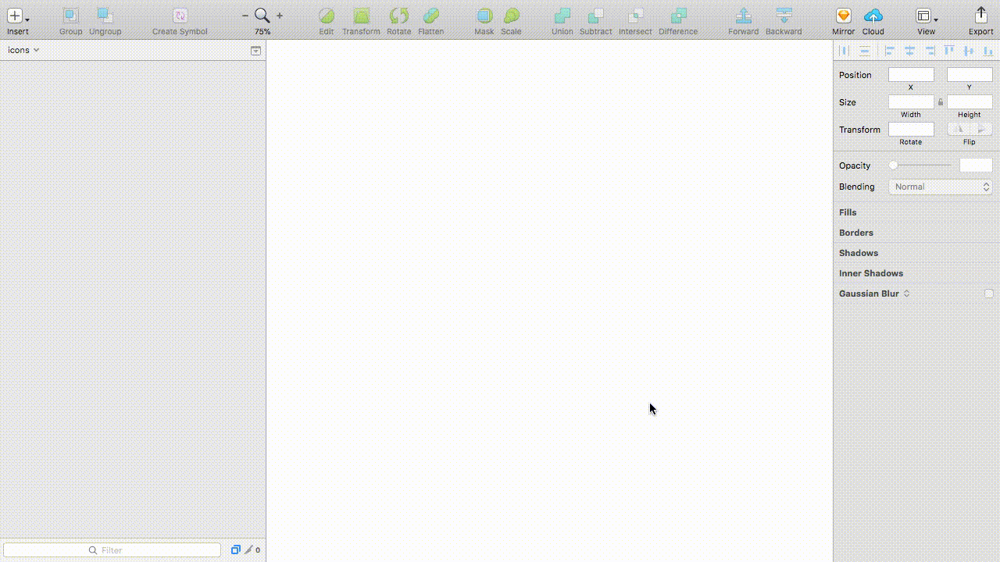
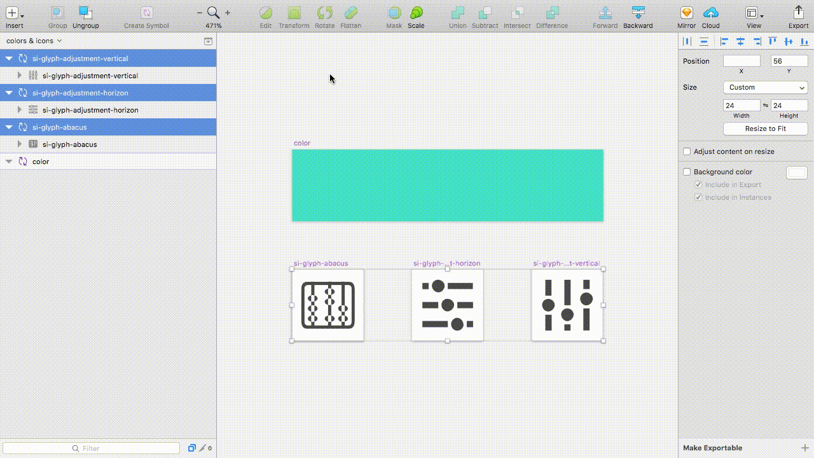

# Sketch Icons

A Sketch plugin that allows you to import a set of icons and automatically apply a color mask.

## Features

1. Import a folder or a set of icons.
2. Choose a color library and apply automatically a color mask.
3. Enjoy your dynamic icons library.

That's all. ❤️

### Import icons

Since the arrival of nested symbols and Sketch libraries, our worfklow has been incredibly improved.

But if, like us, you have wondered how to import all of your icons into Sketch and how to apply a color mask individually... Then this plug-in is made for you.

Just go to `Plugins -> Sketch Icons -> Import icons...` and select your folder or your icons. You can also use the keyboard shortcut `cmd + shit + y`.

And... Voilà ! Your dynamic icons library is ready!

### Update severals icons

To save you even more time, we have designed a feature that allows you to replace or update icons already imported into your library. You will find this feature in `Plugins -> Sketch Icons -> Update icons on selected artboards...`.

### Add a color mask on several icons

If you want to apply a color mask to an icon - or a set of icons - you can use this functionality `Plugins -> Sketch Icons -> Apply a color mask on selected artboards...`.

That's about all you need to know. This should save you a lot of time!

Do not hesitate to come back to us. We want your feedback :)

## How to install the plugin

We recommend installing the plugin with Sketchpacks or Sketch Runner.

### Method 1: Sketchpacks

Open Sketchpacks, search for "Sketch Icons", and click "Install". Or you may click the "Install it with Sketchpacks" button below :)

### Method 2: Sketch runner

Open Sketch Runner, search for "Sketch Icons", and click "Install".

### Method 3: Manually

1. [Download the ZIP file](https://github.com/AMoreaux/Sketch-Icons/releases/latest) and unzip
2. Open `Sketch Icons.sketchplugin`

## Contact/Feedback

Sketch Icons is designed by [Valentin Chrétien](https://twitter.com/valentinchrt) and developed by [Antoine Moreaux](https://twitter.com/Antoine_Moreaux).

If you have any questions, feel free to contact us directly on Twitter or [drop us an email]<moreaux.antoine@gmail.>. Feedback is always appreciated :)

### Thanks guys!

If this plugin saves you time, do not hesitate to send us small messages of thanks! 

You can also [offer us some beers](https://www.paypal.me/AntoineMoreaux).

